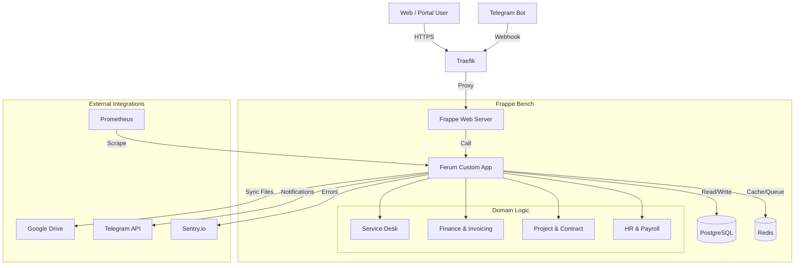

# Ferum Customizations — Architecture Overview (v2.0)

**Date:** 2025-12-16  
**Status:** Consolidated (Phase P0-2)

## 1. High-Level Architecture

The system is built as a monolithic extension (`ferum_custom`) on top of the Frappe Framework / ERPNext v15. It follows a Service-Oriented Logic approach within the Monolith, strictly separating API, Domain Logic, and Data Access.

## 2. Core Modules & DocTypes

### 2.1 Service Desk (Hybrid Model)
*   **Goal:** Transition from custom `Service Request` to standard `Issue`.
*   **Current State:** Hybrid.
    *   **Input:** API `/create_issue` creates an `Issue` but supports legacy fields.
    *   **Logic:** `apps/ferum_custom/ferum_custom/domain/service/` handles business logic.
    *   **Entities:**
        *   `Issue` (Standard) — Main ticket.
        *   `Service Request` (Legacy) — Deprecated, mapped to Issue.
        *   `Asset` (Standard) — Replaces `Service Object`.
        *   `Service Report` (Custom) — Work logs, linked to Timesheets.

### 2.2 Finance & Invoicing
*   **Goal:** Automate billing based on Service Reports.
*   **Entities:**
    *   `Sales Invoice` (Standard) — Generated from approved reports.
    *   `Payment Entry` (Standard) — Synced from bank statements.
    *   `Payment Allocation` (Custom) — Automatic matching of payments to invoices/contracts.

### 2.3 Project Management
*   **Goal:** Track costs and execution per project.
*   **Entities:**
    *   `Project` (Standard) — Central aggregator.
    *   `Contract` (Custom) — Legal agreements, linked to Projects.

## 3. Security Architecture

### 3.1 Authentication
*   **Portal/API:** JWT (JSON Web Tokens).
    *   Issued via `/api/method/ferum_custom.api.auth.login`.
    *   Validated via `before_request` hook (`jwt_before_request`).
*   **Telegram Bot:** Secret Token + IP Allowlist (optional).
    *   Webhook protected by `X-Telegram-Bot-Api-Secret-Token`.
*   **Internal:** Role-Based Access Control (RBAC).

### 3.2 Permission Query Conditions (PQC)
To enforce strict data isolation, we use PQC hooks (`ferum_custom.security_pqc_rules`):
*   **Project PQC:** Users only see Projects they are assigned to (or manage).
*   **Invoice PQC:** Clients only see Invoices for their Customer entity.
*   **Report PQC:** Engineers only see their own reports.

### 3.3 Secret Management
*   **Storage:** Vault or Environment Variables (injected at runtime).
*   **Codebase:** No hardcoded secrets.
*   **Access:** `ferum_custom.settings.get_setting()` is the single point of truth.

## 4. Integration & Observability

### 4.1 Telegram Bot
*   **Stack:** `aiogram` (Python).
*   **Mode:** Webhook (Production) or Polling (Dev).
*   **Features:** Create Issue, My Issues, Attach Photo, Approve Report.
*   **Resilience:** Systemd service, auto-restart on failure.

### 4.2 Google Drive
*   **Flow:** File Upload → `File` DocType → Background Job → Upload to Drive → Update `file_url`.
*   **Security:** Antivirus scan (`clamav`) before upload.

### 4.3 Monitoring
*   **Metrics:** Prometheus endpoint `/api/method/ferum_custom.metrics.get_metrics`.
    *   `ferum_issues_created_total`
    *   `ferum_sla_breaches_total`
*   **Logging:** Sentry SDK initialized in `hooks.py` and Bot.

## 5. Deployment Strategy
*   **Containerization:** Custom Docker image based on `frappe/erpnext`.
*   **Orchestration:** Docker Compose (Single Node).
*   **CI/CD:** GitHub Actions (Lint -> Test -> Build -> Push).

---
**Next Steps (P0-3):** Complete data migration scripts (`patches/v15_5/`) to fully retire `Service Request` tables.