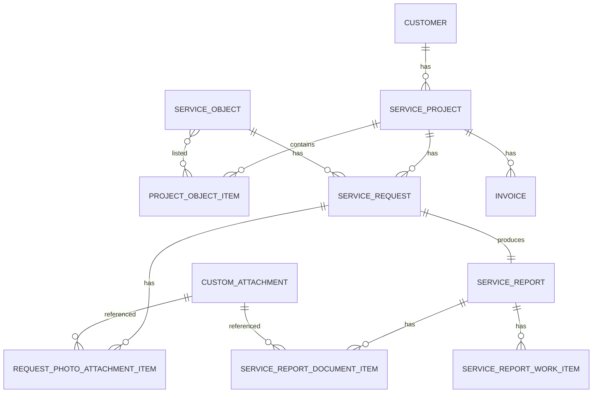
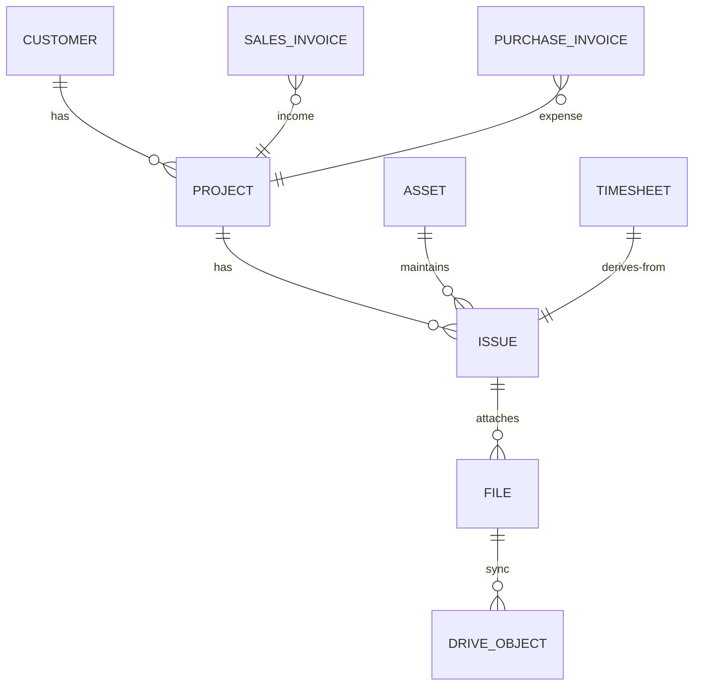
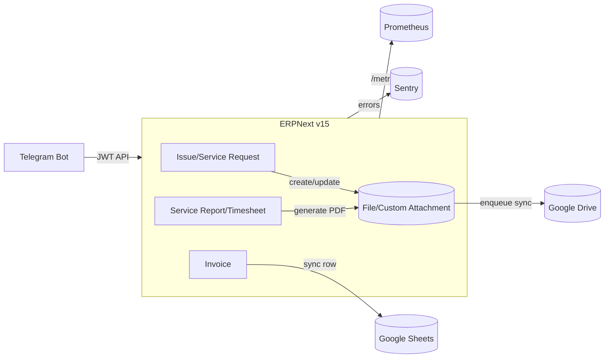

# Ferum Customizations — Аудит системы и целевая архитектура

Дата: 2025‑10‑13

Источник кода: `apps/ferum_custom`

Область: ERPNext v15 (Frappe), кастомные DocType, интеграции (Google Drive/Sheets, Telegram), портал/API, бэкапы/наблюдаемость.

Искусство: минимизировать кастомный Python, опираться на стандартные возможности ERPNext (Workflow, Assignment, Issue, Timesheet, Project, Reports), обеспечить изоляцию данных, идемпотентные миграции и наблюдаемость.

Входные данные (найденные в репозитории)
- `apps/ferum_custom/ferum_custom/docs/*` (архитектура, безопасность, интеграции, ER‑модель, матрица ролей, RU‑документы).
- Код интеграций: `ferum_custom/ferum_custom/ferum_custom/integrations/*` (Drive/Telegram).
- Бизнес‑логика: `ferum_custom/ferum_custom/ferum_custom/doctype/*` (Service Project/Request/Report/Invoice и дочерние).
- API: `apps/ferum_custom/ferum_custom/api/*` (auth, service, attachments, reports, metrics, telegram_bot).
- Hookи/CRON: `apps/ferum_custom/ferum_custom/hooks.py`.

Отсутствующие артефакты (из audit_prompt.md)
- «Модель бизнес.docx», «Архитектура системы.docx», «Данный ответ объединяет … .docx», «Бизнес.docx» не обнаружены как .docx. Использованы эквиваленты из `apps/ferum_custom/ferum_custom/docs/` (в т.ч. `Архитектура системы Многофирменная.txt`, RU‑разделы) и исходный код как основной контекст. При необходимости уточнить нюансы бизнес‑модели — отметить ниже в предположениях.

Ключевые предположения
- Стандартные ERPNext DocType (Issue, Project, Timesheet, Sales/Purchase Invoice) предпочтительны там, где уже начат рефакторинг/миграция.
- Telegram‑бот разворачивается как отдельный сервис; FastAPI может применяться для внешнего шлюза, но критично не дублировать логику ERPNext.
- Google Drive — единое хранилище файлов (истина), ERP `File` и `Custom Attachment` — метаданные/реестр; синхронизация идемпотентна.

## Краткое резюме (Executive Summary)
- Состояние: функционально зрелый монолит ERPNext v15 с продуманными интеграциями (Drive/Sheets/Telegram), контролем доступа (RBAC+PQC) и базовой наблюдаемостью (Sentry/metrics). Начата унификация на стандартные DocType (Issue/Timesheet/Project/Invoices) через патчи и плановые задачи.
- Главные риски: частичное дублирование логики вложений (File vs Custom Attachment), отсутствие централизованной телеметрии по интеграциям и ретраям, ширина охвата JWT (before_request без scoping), отсутствие формальной CI/CD и DR‑тестов восстановления, выбор полного Drive‑scope.
- Быстрые победы: сузить Google Drive scope до `drive.file`, добавить success‑метрики/дешборды интеграций, ограничить применение JWT к API‑пространству, завершить backfill drive_id для файлов, включить автоматическую выгрузку бэкапов на Drive (хук уже подключён).
- Направление To‑Be: больше стандартного ERP (Issue/Timesheet/Project/Asset/Sales&Purchase Invoice), «тонкий» кастом вокруг интеграций и портала, единый сервисный слой для файлов и очередей, строгая матрица ролей + PQC, явные SLO/SLA и аварийные процедуры.

## As‑Is: Архитектура и потоки
- Монолит ERPNext (Frappe v15) + отдельный Telegram‑бот (Aiogram). Интеграции: Google Drive (PDF актов и вложения), Google Sheets (реестр счетов), Sentry/Prometheus.
- Документные события (hooks):
  - `File.on_update -> integrations.drive_file.on_file_update` (загрузка в Drive, запись `drive_file_id/web_link`).
  - `Custom Attachment` (after_insert/on_update/on_trash) — асинхронная синхронизация с Drive.
  - `Service Report.on_submit` — генерация PDF, `File` + `Custom Attachment` + upload Drive.
  - `Invoice.on_update` — пересчет финансов проекта и sync в Google Sheets.
  - Планировщики: SLA‑проверки, генератор заявок из регламентов, бэкап в Drive.
- API: JWT (опционально), методы для заявок/отчетов/счетов, загрузка вложений (multipart), метрики `/api/method/…/metrics.prometheus`.
- Безопасность: RBAC по DocType, PQC по Company/Department/Project/Customer, 2FA для JWT‑логина, rate limits (login/create_request).

## Обнаруженные проблемы/риски/техдолг

| Приор. | Область | Проблема | Риск | Ожидаемый эффект | Рекомендация | Трудозатраты |
| --- | --- | --- | --- | --- | --- | --- |
| High | Интеграции | Дублирование путей загрузки файлов (File hook vs Custom Attachment jobs) | Несогласованность `drive_file_id`, дубли на Drive | Единообразная синхронизация, меньше дублей | Выделить единый FileSyncService; все пути переводить через него; миграция и backfill | 2–3 дн |
| High | Безопасность | JWT `before_request` применим ко всем путям | Токен даёт доступ шире, чем задумывалось | Снижение поверхности атаки | Ограничить на URI `/api/method/ferum_custom.*` или ввести `aud/scope` в JWT и проверять | 0.5–1 дн |
| High | DR/Операции | Нет проверенных DR‑процедур восстановления | Бэкапы могут быть непригодны | Гарантия восстановления | Регламент test‑restore ежеквартально; чек‑лист; автоматизированный прогон | 1–2 дн |
| Medium | Интеграции | Google Drive scope = `drive` (полный) | Избыточные права сервис‑аккаунта | Принцип наименьших привилегий | Перейти на `https://www.googleapis.com/auth/drive.file` | 0.5 дн |
| Medium | Наблюдаемость | Нет success‑метрик и дешбордов по интеграциям | «Тихие» деградации | Быстрое обнаружение сбоев | Счетчики/гистограммы (успех/латентность/ретраи) + Grafana панели | 1–2 дн |
| Medium | Данные | Неполный backfill `drive_file_id` в исторических записях | Потери связности при обновлениях/удалениях | Консистентные ссылки | Идемпотентный скрипт backfill по `File.file_url` ↔ `Custom Attachment` | 1 дн |
| Medium | Архитектура | Частичная кастомная модель (Request/Report/Invoice) vs стандарт ERP | Повторение фич, больше поддержки | Упрощение, меньше кода | Довести миграции на Issue/Timesheet/Project/Sales/Purchase Invoice | 3–5 дн + UAT |
| Medium | Перфоманс | Потенциально тяжёлые списки/отчеты при росте | Время ответа, нагрузки | Прогнозируемость | Индексы (есть патч), серверные пагинации, кэши агрегатов | 1–2 дн |
| Low | Телеграм | Нет централизованного журнала команд/ошибок бота | Сложность RCA | Ускорение поддержки | Логирование в единый индекс (Graylog/ELK) и трейс‑корреляция | 1 дн |
| Low | CI/CD | Нет явных pipeline/линтинга/тестов в CI | Регрессии при выкладках | Качество и скорость | GitHub Actions: lint, unit‑tests (mocked Frappe), безопасность | 1–2 дн |

Подробности по исходникам и текущему статусу интеграций см. `docs/audit/integrations_status.md` и `docs/audit/coverage_map.md`.

## To‑Be: Целевая архитектура
- Данные и процессы — максимально на стандартных DocType:
  - Регламентные работы и разовые заявки — `Issue` + стандартные отчеты и SLA.
  - Учет работ — `Timesheet` с печатными форматами вместо кастомного акта (или мост `Service Report -> Timesheet` в период перехода).
  - Проекты — стандартный `Project` (миграция/маппинг из Service Project).
  - Финансы — `Sales Invoice`/`Purchase Invoice` (кастомный `Invoice` — как тонкая прослойка/портал UI до завершения миграции).
- Интеграции — единый сервисный слой:
  - FileSyncService: единая очередь для Drive (create/update/delete), строгий mapping `ERP File/Custom Attachment <-> Drive fileId`, ретраи/бэк‑офф, метрики.
  - SheetsSync: агрегированная выгрузка (batch) статусов счетов; идемпотентные операции по ключу.
- API/Портал — JWT с `aud/scope`, короткоживущие токены; декларированные лимиты; централизованный audit trail.
- Наблюдаемость — Prometheus метрики по интеграциям, воркфлоу и очередям, алерты; Sentry для исключений.
- DR — ежедневные бэкапы в Drive (есть), ежеквартальные тест‑восстановления, регламенты.

## ER‑модель: До/После (Mermaid)

До (ас‑из, укрупненно)

После (to‑be, с упором на стандартные сущности)

Примечания: `Service Report` сворачивается в `Timesheet` (+ печатные формы). `Service Object` — маппится в `Asset` (есть патч). Кастомный `Invoice` постепенно исчезает.

## Диаграмма потоков (Data‑Flow)

## План рефакторинга (этапы, DoD, обратимость)

Быстрые победы (1–2 недели)
- JWT scoping: ограничить применение `before_request` к API‑неймспейсу или добавить проверку `aud/scope` в токене. DoD: новые интеграционные тесты; текущие клиенты продолжают работать.
- Drive scope: перейти на `drive.file`. DoD: Healthcheck «Check Google Drive» зеленый; все загрузки работают.
- Интеграционные метрики: счетчики успех/ошибка/ретраи для Drive/Sheets/Telegram; 2 панели Grafana. DoD: алерты по 5xx/429 всплескам.
- Backfill `drive_file_id`: идемпотентный джоб по `File.file_url` ↔ `Custom Attachment`. DoD: отчёт «сколько сопоставлено / сколько пропусков».

Mid‑term (1–2 месяца)
- FileSyncService: единый модуль/очередь для всех путей файлов, консолидация кода, idempotency key = (`doctype`,`docname`,`file_url`). DoD: удалены дублирующие ветки, снижено дублирование Drive‑объектов.
- Миграции на стандартные DocType: завершаем перенос `Service Project`→`Project`, `Service Report`→`Timesheet`, `Service Object`→`Asset`, `Invoice`→`Sales/Purchase Invoice` (где применимо). DoD: демо‑сайт и UAT, печатные формы собраны.
- CI/CD: GitHub Actions (lint/tests/build), миграции идемпотентны, фикстуры воспроизводимы. DoD: зеленые пайплайны, релиз‑ноты.

Long‑term
- Портал/бот: унификация на единый API‑шлюз (FastAPI опционально), SSO/JWT refresh, расширенная аналитика.
- Полный DR: автоматизированный test‑restore в staging (ежеквартально), документированный RTO/RPO, runbook инцидентов.
- Расширение наблюдаемости: трассировки (OpenTelemetry), бизнес‑метрики (SLI: %своевременных актов/заявок, средний TTR/TTA).

Обратимость: каждый шаг back‑out через флаг/rollback миграции, прежние пути не удаляются до подтвержденного DoD.

## Матрица ролей и доступов (целевая)
- System Manager: полный доступ.
- Office Manager: чтение/запись SR/Reports/Projects, чтение Invoice, bulk‑операции (где предусмотрено).
- Project Manager: свои проекты, связанные SR/Reports, создание счетов (клиентских), без финансовых агрегатов вне своих проектов.
- Service Engineer: только назначенные SR, создание черновиков Reports/Timesheets, загрузка фото/документов.
- Chief Accountant: все Invoice/финансовые отчёты, изменение статуса счетов (workflow), чтение проектов.
- Department Head: шире в рамках разрешенных Company/Department.
- Client (Website User): только свои SR/Reports по Customer, без доступа к Invoice.

PQC и User Permissions
- Ограничение по Company для внутренних ролей; для Client — по Customer. Для PM/Engineer — по Project/assigned.
- Правила реализованы в `get_permission_query_conditions` и `has_permission` соответствующих DocType (есть в коде); сохранить и покрыть тестами.

## API и интеграции (спецификация, лимиты, ретраи)
- Аутентификация: `POST /api/method/ferum_custom.api.auth.login` (JWT, 1h TTL, 2FA при включенном у пользователя). Заголовок `Authorization: Bearer <token>`.
- Лимиты: `enable_rate_limit_auth`, `enable_rate_limit_create_request` (per IP, минута). Рекомендация: ввести глобальный rate‑limit на write‑методы.
- Endpoint’ы (минимум):
  - Service: list/get/create/update SR; list SRPT; list invoices; confirm actions (для портала клиента).
  - Attachments: multipart upload в SR/SRPT с регистрацией `Custom Attachment` → Drive.
  - Metrics: Prometheus endpoint.
- Google Drive: ретраи c экспоненциальной задержкой (реализовано), фатальные статусы 401/403/404 — алерт и остановка, scope = `drive.file` (целевое).
- Google Sheets: idempotent update по ключу (имя счета); условное форматирование (настройка присутствует), рекомендуется batch‑операции и мониторинг ошибок.
- Telegram: allowlist chat_id, admin usernames, healthcheck; рекомендуется централизованный лог и DLQ для ошибок доставки.

## Roadmap внедрения и SLO/SLA
1) Audit → Design: согласование To‑Be, freeze на новые кастом‑фичи вне плана.
2) Refactor: JWT scoping, Drive scope, метрики, FileSyncService v1.
3) Migrate: по модулям (Project/Asset → Issue/Timesheet → Invoices), двусторонние мапперы и print‑формы.
4) Deploy: staged rollout (staging → ограниченная прод группа → все пользователи).
5) Monitor: дешборды интеграций, Sentry, алерты по SLA.

SLO/SLA (пример)
- SLO интеграций: 99.5% успешных загрузок файлов и строк Sheets за 7 дней (ошибки с ретраями не считаются, если успешно завершились < 15 мин).
- SLA SR: 95% «Emergency/High» старт работ ≤ 4ч; отчеты — 90% PDF за 24ч.

## Критерии качества (acceptance)
- Соответствие ERPNext v15, использование стандартных DocType и Workflow, печатных форм — где возможно.
- Идемпотентные миграции, воспроизводимые фикстуры (UAT/стенд), трассируемость изменений (changelog, миграционные логи).
- Четкие границы компонентов: FileSyncService для Drive, SheetsSync для листов, без скрытых связей.
- Модель безопасности: короткоживущие JWT с `aud/scope`, PQC и User Permissions, secrets вне репозитория.
- DR: ежедневные бэкапы, документированный test‑restore, отчёт по последнему восстановлению.
- Диаграммы и инструкции — самодостаточны, можно собрать (Mermaid/PlantUML), рекомендации имеют приоритет/оценку эффекта и рисков.

## Чек‑лист внедрения
- [ ] Переключить Google Drive scope на `drive.file`, обновить healthcheck.
- [ ] Ограничить JWT на API‑префикс или ввести `aud/scope`‑проверки.
- [ ] Включить метрики интеграций и дешборды.
- [ ] Прогнать backfill `drive_file_id` и сверку дубликатов на Drive.
- [ ] Завершить миграции на стандартные DocType, включить новые печатные формы.
- [ ] Настроить CI/CD (lint/tests), smoke‑тесты миграций.
- [ ] Документировать и проверить DR (test‑restore в staging).

## Модули к удалению/замене стандартными ERPNext
- `Service Request` → стандартный `Issue` (в процессе: генератор регламентов уже создает `Issue`).
- `Service Report` → `Timesheet` (+ печатные формы и вложения через `File`).
- `Service Object` → `Asset` (патч присутствует).
- `Invoice` → `Sales Invoice`/`Purchase Invoice` (в т.ч. опциональный автосоздатель SI уже есть; далее — миграция исторических записей).

— Конец отчета —
