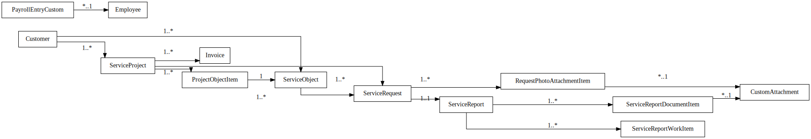

# Entity-Relationship Model

The core data model revolves around a set of custom DocTypes (data entities) in ERPNext that capture the domain concepts, along with relationships between them. The following diagram shows the main entities and their relationships:

Each box represents a DocType (or key model), with primary fields, and lines indicate relationships (arrows point from parent to child or one-to-many link). Below is a description of each entity:

### Customer

- Standard ERPNext doctype representing a client (organization or individual) who receives services.
- Each Customer can have multiple Projects and Issues associated with it.
- Customers also have related Assets (assets at the customer’s site).
- In the ERD, Customer is linked one-to-many with Project and Asset.

### Project

- A standard DocType for maintenance contracts/projects.
- It represents an ongoing service agreement with a customer.
- Fields include project name, start/end dates, status (e.g.
- Active, Completed), contract amount, and a link to the Customer.
- A Project may cover multiple Assets – those can be linked directly or managed separately.
- In the ERD, Project is one-to-many with Issue (since many issues can happen under one project).

### Asset

- A standard DocType representing a specific asset or location that requires service.
- For example, a building’s fire alarm panel, sprinkler system, etc.
- Fields include object name, location/address, type of equipment, and a link to the Customer (who owns it).
- In implementation, Asset also may have a field linking to the current Project (if under contract) – ensuring an asset is tied to at most one active project at a time.
- Asset is connected to Issue (one asset can have many issues over time).

### Issue

- The DocType for service tickets or maintenance issues.
- Fields include a subject/description of the issue, type (routine or emergency), links to Customer, Project, and/or Asset (so the issue is tied to a specific contract and asset), priority level, status, assignment (engineer), and timestamps (creation time, resolution time).
- Issue has a one-to-many relationship with attachments (photos/docs) and a one-to-one (or one-to-many, but practically one) relationship with Timesheet (each issue can have at most one Timesheet for work done).
- In the ERD, Issue is linked to Custom Attachment (for general attachments) and to Timesheet.

### CustomAttachment

- A unified doctype for any file stored (could cover what was “PhotoAttachment” and “DocumentAttachment”).
- Fields include an ID, file URL or Drive ID, file type, and metadata.
- CustomAttachment records are linked to parent documents directly (e.g., File DocType) or via child tables in some cases.
- In the ERD, CustomAttachment is the central file reference.

### Timesheet

- The DocType for work time logging.
- Fields include a link to the related Issue, start/end dates, status (Draft/Submitted), and total hours.
- Timesheet has one child table: Time Log.
- It is typically linked to one Issue (1:1 relationship in logic).
- In the ERD, Timesheet links back to Issue (one timesheet per issue).

### Invoice

- A custom model (could be a DocType in ERPNext or an external entity) representing an invoice for either client billing or subcontractor payment.
- Fields include an ID, linked Project (if applicable), the month/period or date, amount, currency, counterparty (Customer or subcontractor), status (e.g.
- New, Sent, Paid), and references to attachments (like PDF of the invoice or acts).
- In the ERD, Invoice is linked many-to-one with Project (a project can have multiple invoices over time).
- It also implicitly links to Customer or subcontractor, though in the model that may just be a text field or a link to Customer/Supplier.

### PayrollEntryCustom

- A custom DocType extending ERPNext’s Payroll Entry for salary calculations.
- Fields include an ID, payroll period, and total payable amounts, plus possibly a table of individual pays or a link to employees.
- In the diagram, we include Employee (standard ERPNext doctype for employees).
- PayrollEntryCustom likely has a child table of salary slips or references employees, but for simplicity we show a link to Employee (meaning the payroll entry can be associated with employees in some fashion).
- The main point is that employees (and their work time data) feed into PayrollEntryCustom which then produces salary records.
- The relationship can be one PayrollEntry covering many Employees (one-to-many).

### Employee

- Standard doctype for company staff.
- Each Employee can have entries in PayrollEntryCustom.
- (Also employees can be linked as the “assigned engineer” in Issue – though in ERPNext that assignment might use the User or Employee record.)

### User

- (Not depicted in the ERD to avoid clutter) – ERPNext user accounts, each mapped to one or more roles (Admin, Project Manager, etc.).
- Users are linked to Employee records for internal staff.
- Permissions are handled at user/role level rather than as relational links in data.

- This ERD and description cover the primary data structure of the system.
- It is designed to maintain referential integrity (e.g., cannot delete an Asset if linked to active issues) and to efficiently fetch related information (for instance, from an Issue you can navigate to its Project, Customer, Asset, attachments, and timesheet).
